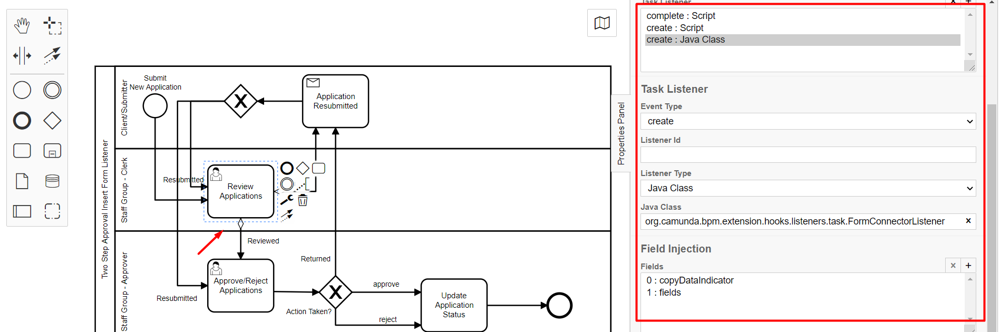

# Combine Submission Bundle Listener 

**org.camunda.bpm.extension.hooks.listeners.CombineSubmissionBundleListener**

This component can be used on any event of task or execution.
Upon configuration, creates a new submission on bundle combining the form data and bundle data.

NOTE: To be used, only to create new submission for a bundle.

## Table of Content
* [Type](#type)
* [How it Works](#how-it-works)
* [How to Use](#how-to-use)

## Type

Task/Execution Listener

### How it Works

This component creates a new submission combining the bundle data and form data retrieved from the bundleUrl and current formUrl, respectively. The resulting submission url is then stored as a CAM variable.
* [STEP 1] - Get the submission data from bundleUrl and formUrl.
* [STEP 2] - Create a new submission on bundle form combining the form data and bundle data.
* [STEP 3] - The new submission url is set as formUrl with CAM variables

The component is dependent on listed variables from camunda context,
1. bundleUrl
2. formUrl

### How to Use

1. Set the bundleUrl to the execution variable before using the **CombineSubmissionBundleListener** and [FormConnectorListener](./formconnector-readme.md ). 
In the case of bundles, the formUrl signifies the URL linked to the bundle submission.
Retrieve the formUrl from the execution and set it as the bundleUrl.

`execution.setVariable('bundleUrl', execution.getVariable('formUrl'));`

2. Configure [FormConnectorListener](./formconnector-readme.md ) to a task.
After the completion of a submission through the connected form, the formUrl is updated to reflect the URL of the form connector submission.

3. Configure the **CombineSubmissionBundleListener** that merges the data from bundleUrl and formUrl generates a new submission for the associated bundle.
   The URL of the newly created submission is then assigned to formUrl.

   
